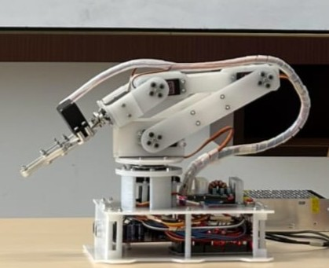

# Robot Arm 5-DOF

Repository ini berisi file-file pengembangan robot arm 5-DOF berbasis Arduino, yang mencakup desain mekanikal dan assembly, desain elektrikal dan PCB, perhitungan serta visualisasi menggunakan Python, program kendali servo, dan dokumentasi pengembangan.

  

## Komponen Proyek
### Mekanikal

Perancangan dan assembly mekanis robot arm, termasuk model CAD dan dokumentasi desain.

### Elektrikal

Perancangan sistem elektrikal, schematic, dan PCB menggunakan KiCad.

### Software

Perangkat lunak untuk perhitungan dan visualisasi invers kinematik robot arm menggunakan Python, serta program Arduino untuk pengendalian servo.

### Dokumentasi

Dokumentasi proses perakitan, perkembangan, dan demonstrasi robot arm.

